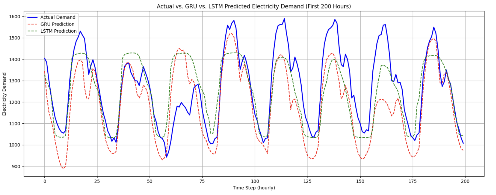
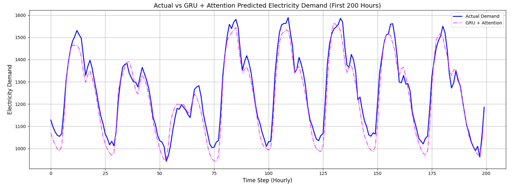
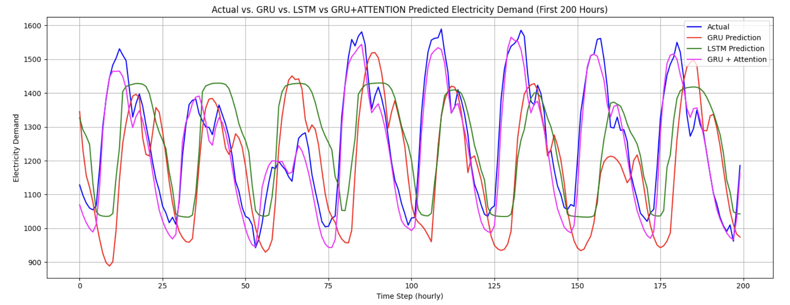

# ⚡ Electricity Load Forecasting

This repository contains a deep learning-based approach to **short-term electricity load forecasting**. The goal is to accurately predict future electricity demand using advanced recurrent neural networks.

---

## 📊 Dataset

- **Source:** [Electricity Load Forecasting Dataset](https://www.kaggle.com/datasets/saurabhshahane/electricity-load-forecasting/data)
- **Description:** Data of various weather variables, such as temperature, relative humidity, precipitation, and wind speed, for three main cities in Panama, from Earthdata.
- **Columns:**
  - `Datetime`: Timestamp of the load data
  - `Load`: Actual electricity load in MW

---

## 🧠 Models Implemented

1. **LSTM (Long Short-Term Memory)**
   - Captures long-term dependencies in time series.
   - Handles vanishing gradient problem better than vanilla RNNs.

2. **GRU (Gated Recurrent Unit)**
   - Simpler and faster alternative to LSTM with comparable performance.
   - Uses update and reset gates.

3. **GRU + Attention Mechanism**
   - Enhances GRU by allowing the model to focus on relevant time steps dynamically.
   - Improves interpretability and forecasting accuracy.

---

## 📈 Results

| Model            |     MSE      |  Accuracy  |
|------------------|--------------|------------|
| LSTM             |  *22348.43*  |  *90.34*   |
| GRU              |  *22136.54*  |  *90.29*   |
| GRU + Attention  |   *3536.14*  |  *96.04*   |

---

### 🔹 Actual vs GRU vs LSTM



---

### 🔹 Actual vs GRU+Attention



---

### 🔹 Actual vs GRU vs LSTM vs GRU+Attention



## 🛠️ Installation

1. Clone the repository:
   ```bash
   git clone https://github.com/Pratyushs411/Load-Forcasting.git
   cd load-forecasting
